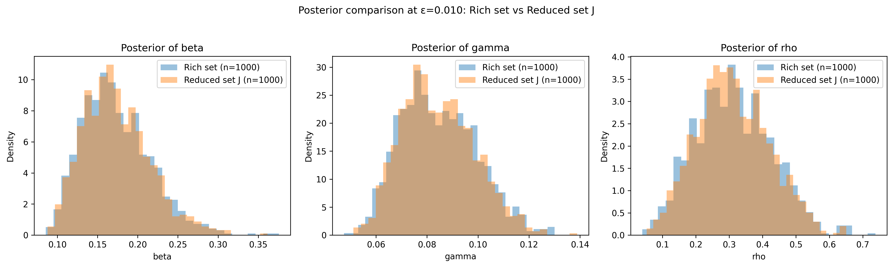
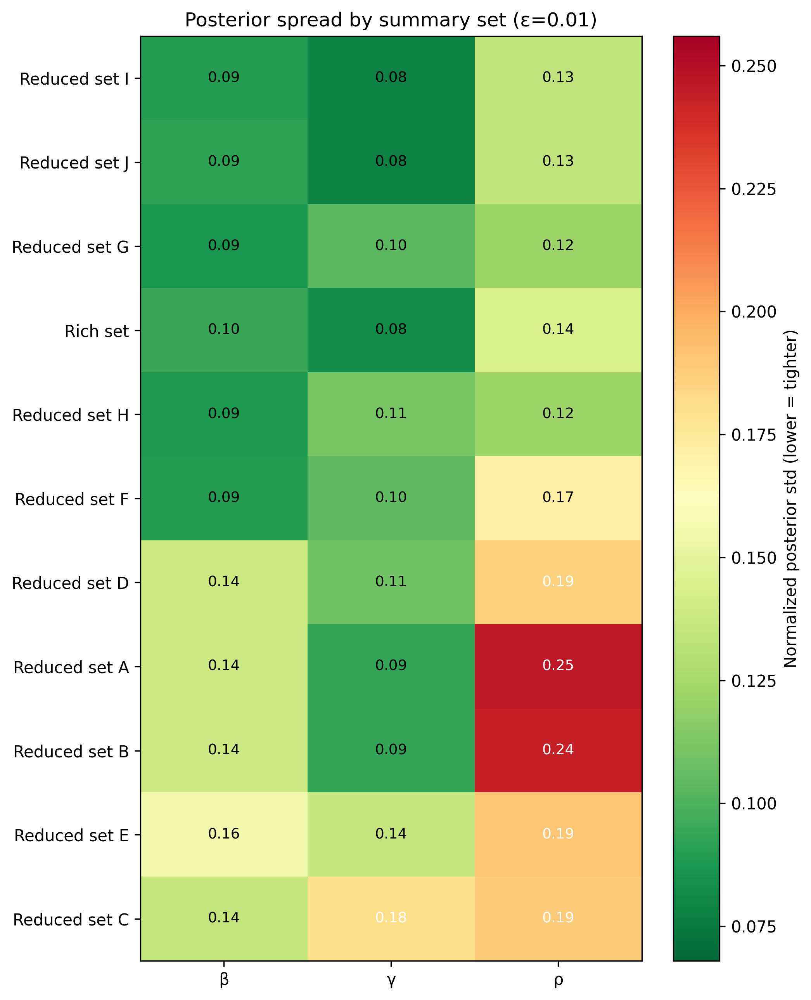

# SBI Infection

Approximate Bayesian Computation workflow for an adaptive-network SIR epidemic model.  
The project estimates the posterior of `(beta, gamma, rho)` using:

- basic ABC rejection
- regression-adjusted ABC
- ABC-MCMC calibrated from the saved rejection run
- Sequential Monte Carlo ABC (SMC-ABC)
- Synthetic Likelihood MCMC (SL-MCMC)

The current report and reproducible output convention are based on the `Reduced set J`
summary calibration exported by `abc_rejection.py`.

## Project Layout

```text
SBI_infection/
├─ data/
│  ├─ infected_timeseries.csv
│  ├─ rewiring_timeseries.csv
│  ├─ final_degree_histograms.csv
│  └─ intermediate/
│     └─ abc_rejection_output.npz
├─ outputs/
│  ├─ basic_abc/
│  ├─ abc_mcmc/
│  ├─ regression_adjustment/
│  ├─ smc_abc/
│  ├─ smc_abc_recovery/
│  ├─ sl_mcmc_recovery/
│  └─ synthetic_likelihood_mcmc/
├─ simulator.py
├─ simulator_optimised.py
├─ observed_summaries.py
├─ abc_rejection.py
├─ abc_rejection_regression.py
├─ abc_mcmc.py
├─ smc_abc.py
├─ synthetic_likelihood_mcmc.py
├─ synthetic_likelihood_diagnostics.py
├─ synthetic_truth_recovery_sl.py
├─ synthetic_recovery_smc_abc.py
├─ runtime_summary.py
├─ abc_report_final_draft.tex
└─ approximate_posterior_exploration.py
```

## Requirements

Run the scripts from the project root (`SBI_infection/`). Several files load data using relative paths.

Required Python packages:

- `numpy`
- `pandas`
- `matplotlib`
- `tqdm`
- `scikit-learn`
- `seaborn`
- `scipy`
- `numba` (for optimized simulator)

## Main Scripts

`simulator.py`  
Simulates one adaptive-network SIR epidemic.

`simulator_optimised.py`  
Highly optimized version of the simulator using `numba` and parallel-ready logic.

`observed_summaries.py`  
Computes the observed summary statistics from the provided data.

`abc_rejection.py`  
Runs the baseline basic ABC rejection pipeline. It also exports the current
reference calibration (`Reduced set J`) for downstream methods and now writes
canonical non-timestamped CSV/plot filenames.

`abc_rejection_regression.py`  
Applies Beaumont-style local linear regression adjustment.

`abc_mcmc.py`  
Runs ABC-MCMC using the chosen reference summary set.

`smc_abc.py`  
Implements Sequential Monte Carlo ABC (Population Monte Carlo ABC). It produces stage-by-stage progression and comparison plots.

`synthetic_likelihood_mcmc.py`  
Implements Synthetic Likelihood MCMC (Wood, 2010). Approximates the summary likelihood with a multivariate Gaussian. Optimized with multiprocessing.

`synthetic_likelihood_diagnostics.py`  
Performs the Assumption Check (normality of summaries) for the SL methodology.

`synthetic_truth_recovery_sl.py`  
Performs a synthetic-truth recovery run using the SL-MCMC pipeline. The saved
recovery plot includes the true value, posterior 95% CI bounds, and a shaded
95% CI band.

`synthetic_recovery_smc_abc.py`  
Performs a synthetic-truth recovery run using the SMC-ABC pipeline. The saved
recovery plot includes the true value, posterior 95% CI bounds, and a shaded
95% CI band.

`runtime_summary.py`
Maintains the shared runtime summary CSV used by the report.

`approximate_posterior_exploration.py`  
Produces separate color-coded seaborn pairplots for visual comparison using the
stable rejection-ABC CSV filenames.

## Summary Statistics

The full model uses eight summaries:

1. Max infection fraction
2. Time to peak
3. Early growth rate of infection
4. Early growth rate of rewiring
5. Variance structure of degree counts
6. Late decay rate of infection
7. Rewiring per infection
8. Infection peak width at half maximum

The summary-set comparison study in `abc_rejection.py` compares the full rich
set with reduced sets A-J.

The current downstream reference is `Reduced set J`, consisting of:

1. Max infection fraction
2. Time to peak
3. Variance structure of degree counts
4. Rewiring per infection
5. Infection peak width at half maximum

All extension methods in the report are calibrated against this saved
`Reduced set J` reference output.

## Reproducible Outputs

Plots and CSVs are written to deterministic filenames so repeated runs
overwrite the same canonical artifacts.

Examples:

- `outputs/basic_abc/param_estimates/abc-basic_eps-0.0100.csv`
- `outputs/basic_abc/joint_posteriors/joint_posteriors.png`
- `outputs/basic_abc/posterior_predictive_checks/ppc_all_observables.png`
- `outputs/basic_abc/sanity_check/summary_Max infection fraction_overlay_eps.png`
- `outputs/basic_abc/summary_set_study/posterior_rich_set_vs_reduced_set_j_eps-0.0100.png`
- `outputs/smc_abc/param_estimates/smc_abc_output.csv`
- `outputs/synthetic_likelihood_mcmc/synthetic_likelihood_output.csv`
- `outputs/sl_mcmc_recovery/plots/synthetic_truth_recovery_sl.png`

## Example Figures

The following figures are generated by `abc_rejection.py` and are the current
canonical visuals used in the report for the reduced-summary comparison:

**Rich set vs Reduced set J posterior comparison**



**Posterior spread heatmap across summary sets**



## Recommended Run Order

1. Run basic rejection ABC:
```powershell
py abc_rejection.py
```

2. Run regression adjustment:
```powershell
py abc_rejection_regression.py
```

3. Run ABC-MCMC:
```powershell
py abc_mcmc.py
```

4. Run SMC-ABC:
```powershell
py smc_abc.py
```

5. Run SMC-ABC recovery:
```powershell
py synthetic_recovery_smc_abc.py
```

6. Run Synthetic Likelihood MCMC:
```powershell
py synthetic_likelihood_mcmc.py
```

7. Run SL-MCMC diagnostics and recovery:
```powershell
py synthetic_likelihood_diagnostics.py
py synthetic_truth_recovery_sl.py
```

8. Optional: explore posteriors visually:
```powershell
py approximate_posterior_exploration.py
```

## Report

The main report source is:

- `abc_report_final_draft.tex`
